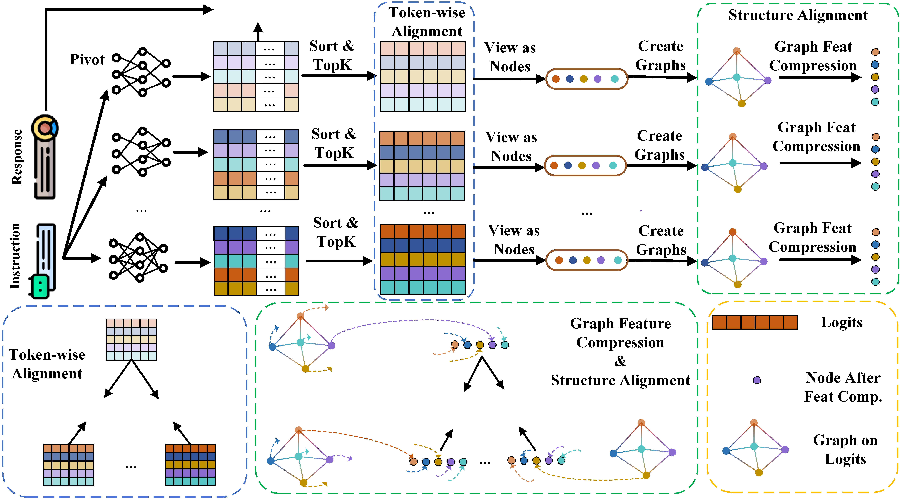
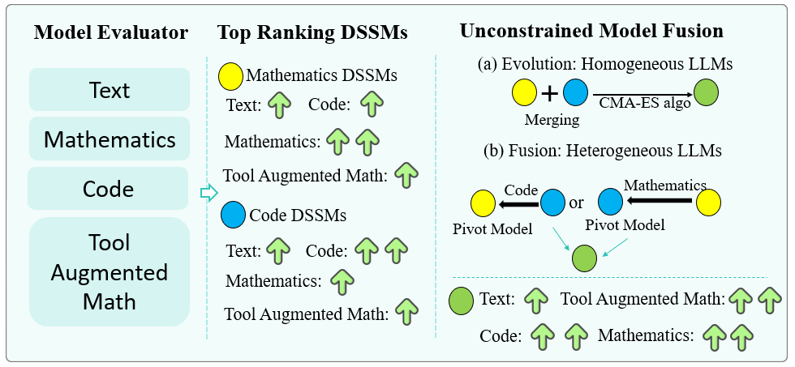



Education
======
* Ph.D in The Hong Kong Polytechnic University, 2028 (expected)
* M.Sc. in Techische Universität München, 2023
* B.E. in Harbin Institute of Technology, 2019

Publications
======
<table>
  <tr>
    <td style="width:320px">
      
    </td>
    <td style="vertical-align:top; padding-left:16px">
      <a href="https://arxiv.org/abs/2505.13878"><b>InfiFPO: Implicit Model Fusion via Preference Optimization in Large Language Models</b></a> 
      Yanggan Gu, Zhaoyi Yan, Yuanyi Wang, <b>Yiming Zhang</b>, Qi Zhou, Fei Wu, Hongxia Yang
    </td>
  </tr>

  <tr>
    <td style="width:320px">
      
    </td>
    <td style="vertical-align:top; padding-left:16px">
      <a href="https://arxiv.org/abs/2505.13878"><b>InfiGFusion: Graph-on-Logits Distillation via Efficient Gromov-Wasserstein for Model Fusion</b></a> 
      Yuanyi Wang, Zhaoyi Yan, <b>Yiming Zhang</b>, Qi Zhou, Yanggan Gu, Fei Wu, Hongxia Yang
    </td>
  </tr>

  <tr>
    <td style="width:320px; vertical-align:top;">
      
    </td>
    <td style="vertical-align:top; padding-left:16px;">
      <a href="https://arxiv.org/abs/2410.13699" style="text-decoration:none;">
        <strong>Unconstrained Model Merging for Enhanced LLM Reasoning</strong>
      </a>
      

        <b>Yiming Zhang</b>, Baoyi He, Shengyu Zhang, Yuhao Fu, Qi Zhou, Zhijie Sang, Zijin Hong,
        Kejing Yang, Wenjun Wang, Jianbo Yuan, Guanghan Ning, Linyi Li, Chunlin Ji, Fei Wu, Hongxia Yang
      

    </td>
  </tr>

</table>

  
[**InfiFPO: Implicit Model Fusion via Preference Optimization in Large Language Models**](https://arxiv.org/abs/2505.13878)  
Yanggan Gu, Zhaoyi Yan, Yuanyi Wang, Yiming Zhang, Qi Zhou, Fei Wu, Hongxia Yang

  
[**Unconstrained Model Merging for Enhanced LLM Reasoning**](https://arxiv.org/abs/2410.13699)  
Yiming Zhang, Baoyi He, Shengyu Zhang, Yuhao Fu, Qi Zhou, Zhijie Sang, Zijin Hong, Kejing Yang, Wenjun Wang, Jianbo Yuan, Guanghan Ning, Linyi Li, Chunlin Ji, Fei Wu, Hongxia Yang

Work experience
======
* **Research Assistant | Moder Merging** (10.2024-05.2025)

  Supervisor: Prof. Hongxia Yang, Department of Computing, The Hong Kong Polytechnic University, Hong Kong

* **Development Engineer | Data Closed-loop** (08.2023-08.2024)

  R & D Department, iMotion Automotive GmbH, Germany 

* **Data Scientisit Intern | Continuous Intraday Market Forecasting and Optimizing** (05.2022-06.2023)

  Supervisor: Prof. David Wozabal, Dr. Wolfgang Ridlinger, Data Science Department, Entrix, Germany
  
Awards
======
* Graduate with merit at TUM, Germany, 07.2023
* First Prize: National College Students Mathematical Competition, 10.2016
* First Prize (Ranking No. 17): National High School Mathematical Competition, 10.2014

